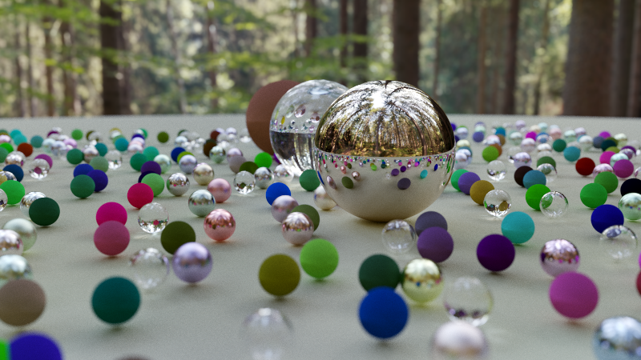

# Ray Tracing In One Weekend

Coding for fun.

Starting here - https://raytracing.github.io/books/RayTracingInOneWeekend.html

Looking here - http://www.pbr-book.org/

Then I have designs and intentions which may (or eventually may not) involve Vulkan, compute shaders, and RTRT.
